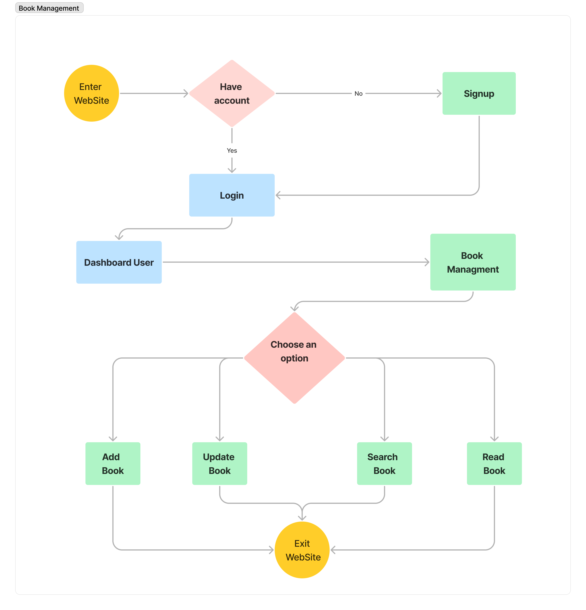

<h1>Book Library Web Application</h1>
<h3>Project Overview:</h3>

The Book Library is a web application designed for managing a personal book collection. It aims to provide users with a convenient way to keep track of their books, monitor their reading progress, and easily search and filter their collection based on various criteria. Whether you're an avid reader or just someone who enjoys keeping their bookshelf organized, this project is here to make your book management experience more efficient and enjoyable.
Problem Statement:

Managing a personal book library can be a daunting task, especially as your collection grows. It's easy to lose track of what books you have, where they are, and how far you've read in each one. The Book Library project aims to solve this problem by offering a user-friendly platform for book enthusiasts to organize, categorize, and monitor their reading journey.
Features and Functionality:

    Add Books: Users can easily add books to their library by entering book details, including title, author, genre, and current reading progress.
    Track Reading Progress: Keep tabs on your reading progress by updating the current page or chapter you're on.
    Search and Filter: Quickly find books based on author, genre, title, or reading status.
    User Profiles: Personalized user profiles for tracking your reading history and preferences.
    Responsive Design: Ensures a seamless experience on both desktop and mobile devices.

<h3>Technologies Used:</h3>

    Frontend: HTML, CSS, JavaScript
    Backend: Python, Flask 
    Database: MySQL

<h3>Screenshots or Demo:</h3>

    

<h3>Roadmap and Future Enhancements:</h3>

We have exciting plans for the future of the Book Library project. Some potential enhancements include:

User reviews and ratings for books.
Integration with external book databases to auto-populate book details.
Social sharing features to discuss books with friends.
Enhanced book statistics and recommendations.
Mobile app versions for Android and iOS.

<h3>Contact Information:</h3>

    Project Author: Merveil HOUENAGNON
    Email: merveil@email.com
    GitHub: https://github.com/houenagnon

Feel free to customize this template with specific details about your project and your contact information. Additionally, if you have any unique features or design aspects you'd like to highlight, be sure to include them in the README. Good luck with your Book Library project!